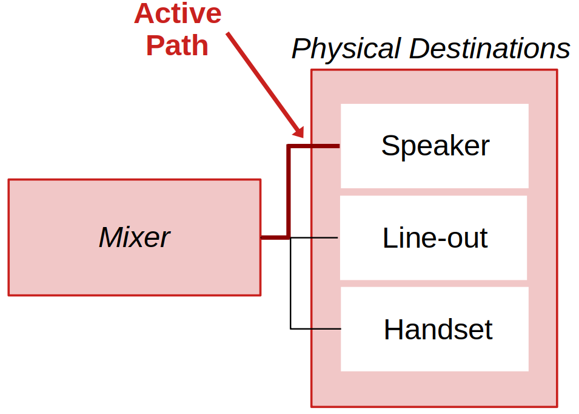

# PHONE CONFIGURATION
## How to configure (hack!) your phone to work with LDSP

As discussed earlier ([Introduction](0_introduction.md)), the foremost requirement consists of rooting the phone. The XDA forum is the best place to look for guides/how-tos and get help:
[https://forum.xda-developers.com/](https://forum.xda-developers.com/)

Then, to configure a phone, we need to populate a hardware configuration file, called ***ldsp_hw_config.json***, that provides LDSP with the info necessary to access low-level audio, effectively bypassing Android’s sandboxed audio stack. Every model requires a specific hardware configuration file; in the next sections of this file we will explain how to generate one for your phone! 

>**Note:** a list of pre-generated files is available in the repo, at *[LDSP/phones/](../phones)*. If your phone is in the list, you're all set and you can skip to SECTION...

The process is a bit challenging but fun (it really feels like hacking!), and it will allow you to better understand how audio works on Android. 

As briefly mentioned in the introduction, unfortunately not all Android builds can be hacked, meaning that some of the reasorces that should be pointed out in the configuration file are not present/available on the phone. This guide will show you how to spot these unfortunate edge cases too.
 


<br>

### 0. Template and Scripts

A template hardware configuration file can be found in [LDSP/phones/_template](../phones/_template). Its a JSON file (*ldsp_hw_config.json*) with several entries, but only a subset are mandatory, namely those that are not surrounded by square brakets. In this guide, we will cover for the most part mandatory entries. For a detailed explanation of all entries, please refer to [LDSP/phones/_template/ldsp_hw_config_README.md](../phones/_template/ldsp_hw_config_README.md) [UNDER CONSTRUCTION]. All the entries are represented by JSON key-value pairs, yet values are all empty in the template. 

Before start populating the entries with the info about your phone, we should:

- **Create a new folder** where to store the new configuration file. We recommend following the same logic we are using in the repo, i.e., in [LDSP/phones/](../phones/) create a parent folder named after your phone's vendor (or simply use an existing one if there already), then a subfolder named after the model. We put the *codename* of the model in parenthesis—e.g., *Moto G7 (river)*—but you can skip this detail. Most codenanames can be sourced here: [wiki.lineageos.org/devices/](wiki.lineageos.org/devices/)

- **Make a copy of the template** in the newly created folder and simply call it *ldsp_hw_config.json*.

- **Install LDSP scripts on the phone:** to ease out the process of gathering info/fill out the entries of the file (hence facilitating hacking), we created a set of convenient 'hacking' scripts (*LDSP scripts*) that are designed to run on the phone. To install them:
    - Open a **shell** on your computer (on Windows, we recommend PowerShell) and navigate to the **LDSP folder**, where you downladed the content of the repo.
    - We'll use the main *ldsp script* to install the LDSP scripts to the phone (more details about the main script in [the next doc page](4_usage.md)). Make sure that your phone is connected via USB and then type:
            
        #### macOS and Linux
        ```console
        ./scripts/ldsp.sh install_scripts
        ```

        #### Windows
        ```console
        .\scripts\ldsp.bat install_scripts
        ```
    While all the LDSP scripts are supposed to run **on the phone**, we will invoke them via the main *ldsp script* that is part of your local LDSP installation. This script will in turn access the phone and run the scripts remotely. 

<br>

### 1. Phone Details Entries
The first three entries regard some general phone details and are:
```json
"device": "", ---> name of the device
"target architecture": "", ---> 32 bits (armv7a) or 64 bits (aarch64)
"supports neon floating point unit": ""  ---> true or false
```
They can be easily retrieved via one of the LDSP scripts (*ldsp_phoneDetails.sh*). To run the script on the phone, simply open a **shell** on your computer (i.e., a 'local' shell), navigate to the **LDSP folder** and type:

#### macOS and Linux
```console
./scripts/ldsp.sh phone_details
```

#### Windows
```console
.\scripts\ldsp.bat install_scripts
```

>**Note:** alternatively, you can run all LDSP scripts directly from the phone; just open a shell on the phone via `adb shell` (i.e., a 'remote' shell) and run the scripts directly from */data/ldsp/scripts*, with the command `sh ./ldsp_phoneDetails`. You're more than welcome to peek into the source code of the scripts too! Sometimes they look 'weird', but this is due to the fact that many Android phones ship with only a minimal set of standard command-line utilities and ```grep``` is most often the way to go.

The output should look something like this (for example, on a Moto G7 phone):
```console
Entries for ldsp_hw_config.json:
	device: motorola moto g(7)
	target architecture: aarch64
	supports neon floating point unit: true
Android version: 14

```
You can now copy the first three entries in your configuration file, like this:

```json
"device": "motorola moto g(7)",
"target architecture": "aarch64",
"supports neon floating point unit": "true"
```
The name of the device is arbitrary, meaning that you can choose whatever you want (: But the script returns what found in the phone's properties.

The last line outputted from the script is not needed for the configuration file, but it will come in handy when running the LDSP applications (see [usage doc](4_usage.md)).

<br>

### 2. Mixer Settings
Every Android phone is equipped with a hardware **audio mixer**. This device carries out a variety of important tasks, including routing various inputs and outputs (e.g headphones versus speakers, long- versus short-range microphones) and adjusting gain levels. 

Under standard operating conditions, user applications cannot access it—and here comes hacking! We need to source all the info necessary for LDSP to access and properly operate the mixer. This requires a few steps, all represented by some entries in the configuration file and outlined in the next subsections.

#### 2a. Mixer Paths XML File
While carrying out the same general operations, the audio mixer of each phone works slightly different. This means that the commands that LDSP applications have to dispatch to it to control audio are hardware dependent. On Android, the full list of commands tailored for the underlying hardware mixer are stored in an XML file, generally called *mixer_paths.xml*. The first *mixer settings* entry in our configuration file is the **location of this XML file within the file system**:

```json
"mixer settings":
{
    "mixer paths xml file": "",
    ...
```
The location may vary, depending on vendor and model. LDSP comes with a script that helps us find it!

Open a **local shell**, navigate to the **LDSP folder** and type:

#### macOS and Linux
```console
./scripts/ldsp.sh mixer_paths
```

#### Windows
```console
.\scripts\ldsp.bat mixer_paths
```

The script searches two common directories where vendors typically place mixer paths files—*/etc/* and */vendor/etc*—and, if successful, it will return the full path of the file. For example:
```console
ldsp.sh mixer_paths
Searching mixer paths files in /etc/
No mixer paths files found

Searching mixer paths files in /etc/vendor
Mixer paths files found:
    /etc/vendor/mixer_paths.xml
```
The path can then be copied into the XML entry:

```json
"mixer settings":
{
    "mixer paths xml file": "/etc/vendor/mixer_paths.xml",
    ...
```
Notice that the name of the file may be different than simply *mixer_paths.xml*.

Once the mixer paths file is found, it is convenient to **copy it over your host computer**, because in the [next step](#2b-playback-and-capture-paths) it is necessary to analyze its content. You can use `adb` and ask it to pull the file to any local folder, for example:
```console
adb pull /etc/vendor/mixer_paths.xml ~/Downloads
```


If **no mixer paths file is found in the default directories**, you can specify a custom one as a command line argument for the script. Additionally, LDSP comes with a **recursive version of the script** that searches in the specified directory and all its subdirectories. Here is, for example, how to search recursively in */vendor/etc* (another commond dir) on macOS and Linux: `./scripts/ldsp.sh mixer_paths_recursive /vendor/etc` (the script can be called on Windows too, via `ldsp.bat`). And here is the example output on the Moto G7:
```console
Searching for mixer XML files in /vendor/etc
Found mixer paths file: /vendor/etc/mixer_paths.xml
Found mixer paths file: /vendor/etc/mixer_paths_madera_epout.xml

```
> #### What if more than one mixer paths file is found as in this case?
> Simply choose one from the list, copy its path in the XML entry and pull the file to your computer. The analysis at the [next step](#2b-playback-and-capture-paths) will unveil if you chose the correct one!

> #### What if no mixer paths file is found, even when searching recursively in the phone's root directory ( */* )?
> Unfortunately, this means that the Android version running on this phone does not comply with Google's audio standards and is <strong style="color: red;">not compatible with LDSP ):</strong>

#### 2b. Playback and Capture Paths
The next portion of the mixer settings within the configuration file pertains to the activation of mixer routes. Specifically, it is designed to allow LDSP to route the mixer's output (**playback**) to physical destinations (speaker, headphone/line out, or headset) and how to route input from physical sources (long-range mic, line in, or headset/short-range mic) into the mixer (**capture**). 
```json
"playback path names":
{ 
    "speaker": "",
    "line-out": "",
    "handset": ""
},
"capture path names":
{
    "mic": "",
    "line-in": "",
    "handset": ""
}
```

In Android, these routes are called **paths**, hence the names of the entries to fill in. Here is a visual depiction of generic playback routes/paths:


>**Note:** the headphone socket of all phones supports *combo jacks*, hence it works as **both stereo output (for headphones) and mono input (for wired mics)**! Combo headphones (which combine headphones and a wired mic) allow to use this socket in both directions at the same time.

 As the name suggests, the *mixer paths* XML file contains all the commands necessary to activate the paths. In most cases, a single path requires that a sequence of commands is invoked on the mixer. For this reason, the XML file is organized in *path* elements, each containing several commands and characaterized by a name that reflects the nature of the path. Here are the three main playback path elements found in the Moto G7's *mixer_paths.xml* file:
 ```xml
<path name="speaker">
    <ctl name="SLIM_0_RX Channels" value="One" />
    <ctl name="SPK AMP PCM Gain" value="18" />
    <ctl name="AIF1TX1 Input 1 Volume" value="36" />
    <ctl name="SPK PCM Source" value="DSP" />
    <ctl name="AIF1TX1 Input 1" value="SLIMRX1" />
    <ctl name="SPK AMP Enable Switch" value="1" />
</path>

<path name="headphones">
    <ctl name="SLIM_5_RX Channels" value="Two" />
    <ctl name="ISRC2INT1 Input 1" value="SLIMRX5" />
    <ctl name="HPOUT1L Input 1" value="ISRC2INT1" />
    <ctl name="ISRC2INT2 Input 1" value="SLIMRX6" />
    <ctl name="HPOUT1R Input 1" value="ISRC2INT2" />
    <ctl name="HPOUT1 Digital Volume" id="0" value="120" />
    <ctl name="HPOUT1 Digital Volume" id="1" value="120" />
    <ctl name="HPOUT1 Digital Switch" id="0" value="1" />
    <ctl name="HPOUT1 Digital Switch" id="1" value="1" />
</path>

<path name="handset-spkout">
    <ctl name="SPKOUT Input 3" value="None" />
    <ctl name="Speaker Digital Volume" value="160" />
    <ctl name="SPKOUT Input 1" value="SLIMRX1" />
    <ctl name="Speaker Digital Switch" value="1" />
</path>
 ```
The names of these three paths—which are device dependent—must be **copied in the playback path names entries** of the configuration file, like this:
```json
"playback path names":
{ 
    "speaker": "speaker",
    "line-out": "headphones",
    "handset": "handset-spkout"
}
```
This allows LDSP to activate whatever playback destination on the phone at run time (see [usage doc](4_usage.md))! 

Likewise, the phone's **XML file needs to be analyzed in search of the three capture paths** and their names must be ported to the configuration file, to allow for runtime capture control. 

> #### What if my phone does not come with an headphone socket (line in/out)?
> In that case, the *line-out* and *line-in* paths are not present in the mixer, hence you can leave those configuration entries empty. You can though leverage line input/output via a USB-to-headphones adapter. Effectively, the adapter works as an external USB audio interface and LDSP supports this configuration (see [usage doc](4_usage.md))!


Finding the right paths to port to configuration file entries may not be straighforward! In general, mixer paths XML files contain a huge number of paths that describe all the audio functionalities of the phone, including those that go beyond the current scope of LDSP (e.g., compressed output for calls). 

logcat

wrong file

[UNDER CONSTRUCTION]

 [Previous: Installation](2_installation.md) | [Next: Usage](4_usage.md)